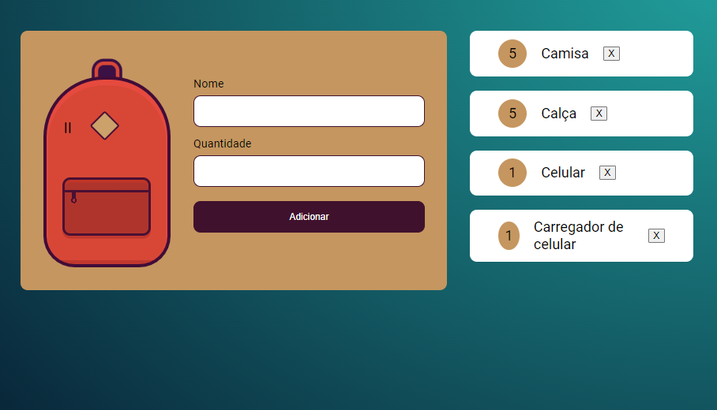

<div align=center>
  <h1>
    JavaScript : Armazenamento de dados no navegador
  </h1>

  
</div>

[Acessar Projeto](https://)

# Curso de JavaScript feito pela Alura
    Nesse curso terá armezanenamentos de dados no navagador.
    Interações com o Local Storage com dados de um formulário.
    Atualizando a sua interface e salvando esses dados no navegador.
    Como alterar Local Storage, criando um item, pegando os intens e removendo.
    Limpando o Local Storage.
    Interações com JavaScript: Arrays, criação de elementos, Classes, etc...

# Aprendizado:
  Aprendemos na prática como refatorar nosso código melhorando a legibilidade;    
  
  Alteramos os valores de uma lista em string utilizando o método JSON.stringify;
     
      O método JSON. stringify() converte valores em javascript para uma String JSON. Esses valores podem ser substituidos especificando a função replacer, ou incluindo somente as propriedades específicas, quando o array do replacer for especificado.


  Alternativa que contenha métodos próprios do localStorage para manipulação de dados:
      
      localStorage.clear(), localStorage.setItem(), localStorage.removeItem(),      localStorage.getItem(), localStorage.length(), localStorage.key().
      Esses são exemplos de métodos próprios do localStorage para manipulação de dados.

  Aprendemos como alterar valores de tipo texto, para valores JavaScript com o método JSON.parse:

  ```js
  const itens = JSON.parse(localStorage.getItem("itens")) || [];
  ```

  Aplicamos o método forEach() para manter os itens criados na página, mesmo após atualizá-la:
  
  ```js
  itens.forEach((elemento) => {
    criaElement(elemento);
  });
  ```
  
  Utilizar o método find();

    Com o método find(), ele procura um elemento e, com o operador de comparação ===, ele compara se o valor e tipo de dois elementos são idênticos.
  
  Utilizar a condicional if, else;

    executa a afirmação, dentro do bloco, se determinada condição for verdadeira. Se for falsa, executa as afirmações dentro de else.
  
  Atualizar itens, tanto no navegador, quanto no localStorage.

  ```js
  function atualizaElemento(item) {
    document.querySelector(
      "[data-id='" +item.id+ "']"
    ).innerHTML = item.quantidade
  };
  ```
  
  Desenvolvemos uma função para deletar itens de um array, utilizando os métodos splice(), find() e remove();
  ```js
  function deleteElement(tag, id) {
    tag.remove()

    itens.splice(itens.findIndex(elemento => elemento.id === id), 1)

    localStorage.setItem("itens", JSON.stringify(itens));
  };
  ```
  
  Refatoramos a condicional da const itemAtual.
  ```js
  const itemAtual = {
    "nome": nome.value,
    "quantidade": quantidade.value
  };

  if (addItemExistente) {
    itemAtual.id = addItemExistente.id

    atualizaElemento(itemAtual);
    itens[itens.findIndex(
      elemento => elemento.id === addItemExistente.id
    )] = itemAtual
  } else {
    itemAtual.id = itens[itens.length -1] ? (itens[itens.length -1]).id + 1 : 0;

    criaElement(itemAtual);

    itens.push(itemAtual);
  };
  ```